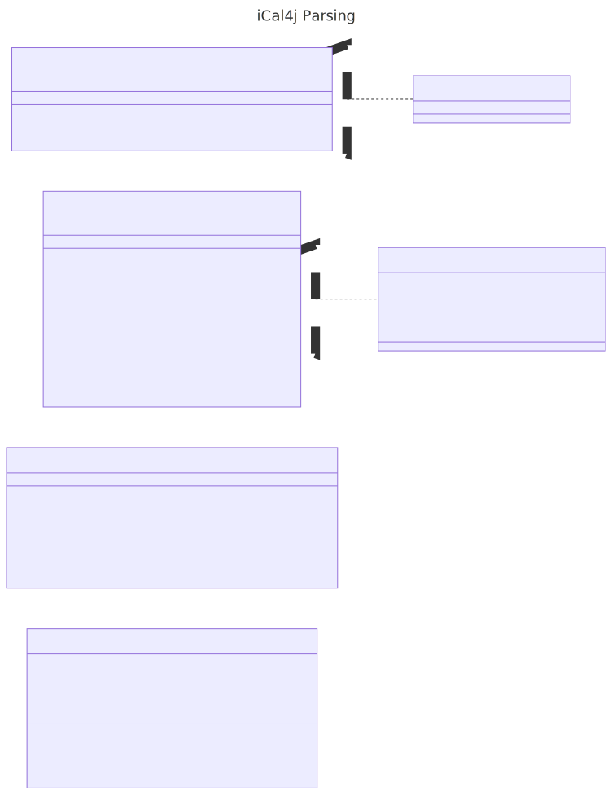

# iCal4j Parser

[[Javadoc]](https://javadoc.io/doc/org.mnode.ical4j/ical4j/latest/ical4j.core/net/fortuna/ical4j/data/package-summary.html)

The iCal4j parsing functionality is designed to allow the use of alternate parser and content handler implementations.

### [net.fortuna.ical4j.data.CalendarParser](http://javadoc.io/doc/org.mnode.ical4j/ical4j/latest/ical4j.core/net/fortuna/ical4j/data/CalendarParser.html)

The CalendarParser interface defines two methods that implementors must provide implementations for. The first method parses data from a java.io.InputStream, whilst the second reads from a java.io.Reader. Both methods must notify the specified ContentHandler by calling the appropriate methods on parse events. The default parser implementation used by iCal4j is the [net.fortuna.ical4j.data.CalendarParserImpl](http://javadoc.io/doc/org.mnode.ical4j/ical4j/latest/ical4j.core/net/fortuna/ical4j/data/CalendarParserImpl.html).

### [net.fortuna.ical4j.data.ContentHandler](http://javadoc.io/doc/org.mnode.ical4j/ical4j/latest/ical4j.core/net/fortuna/ical4j/data/ContentHandler.html)

Implementors of the ContentHandler interface typically use the parse event notification methods to build a calendar representation (i.e. an object model). The default ContentHandler implementation for iCal4j is the CalendarBuilder.

### [net.fortuna.ical4j.data.CalendarBuilder](http://javadoc.io/doc/org.mnode.ical4j/ical4j/latest/ical4j.core/net/fortuna/ical4j/data/CalendarBuilder.html)

CalendarBuilder is the default starting point for parsing an iCalendar data stream into an iCal4j object model. A CalendarBuilder instance requires both a CalendarParser (for parsing the data stream) and TimeZoneRegistry instance, however contructors are available that will use default implementations.
