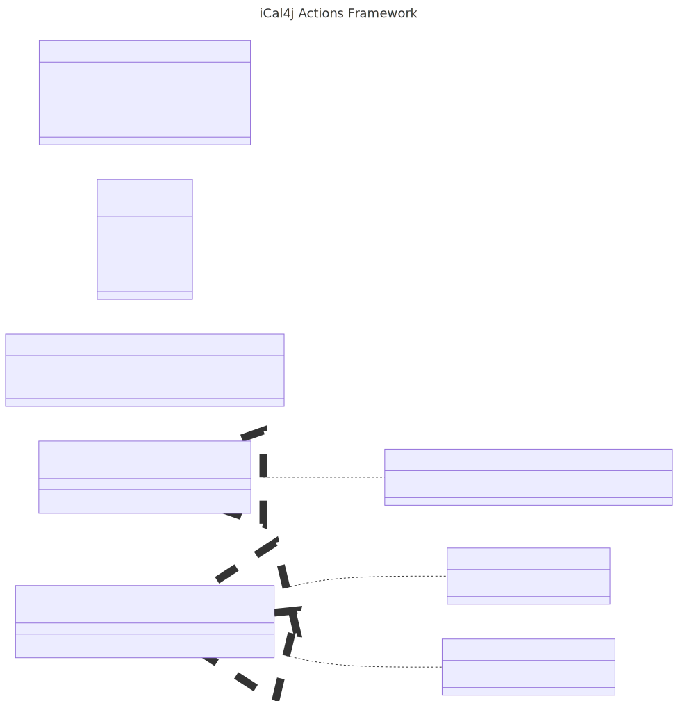

# iCal4j Streams

Reactive programming for iCalendar and vCard.

## Overview

Calendaring and scheduling applications may typically include responding to
conditions that trigger certain actions. For example, notifications must be sent for
approaching events, overdue tasks, and other conditions that require human interaction.

Automated processes also may be triggered by similar conditions, such as updating
participation status in a calendar when a response from an attendee is received.

This library provides a simple framework for publishing and responding to trigger conditions
common to the iCalendar and vCard specifications. It uses Java Reactive Streams to implement
a resilient observer pattern that won't negatively impact performance of the observable target.

## Record

A record is an immutable object instance containing relevant details of a condition or
state change in an iCalendar or vCard model. A record includes a reference to the source
object, a URI representing the context of the object (e.g. a collection, a channel, etc.),
the type of record, and a timestamp indicating when it occurred.

Applications that publish records implement the `Flow.Publisher<Record>` interface in
order to notify subscribers of model or state changes.

## Trigger

A trigger implements the custom logic required to respond to changes in conditions
or state. A trigger is similar to an event handler, with the main difference being
each trigger instance is associated with a single record subscriber.

## Record Subscriber

A record subscriber listens for new records and notifies its associated trigger.
A record subscriber may be configured to control the flow of records depending on the
requirements of the trigger (e.g. triggers that take a long time to complete
may require tuning in the subscriber).
